#### "**First, I want to thank you all (Instabug team) for letting me reach this phase of the process, regardless of the result.**"

---

### This Document Is Prepared By **<u>Emad Eldin Adel</u>** For Instabug Internship To Explain a Very important Tool For Security (Sealed Secret) 

- **What is Sealed Secrets ?** :it is a tool that you can use to manage your secrets and it can work with environments like Kubernetes and Terraform  

- **Why We need Sealed Secrets ?** : let's Explain this With Example ,, 

  > - if i have a database and i need to generate a password to connect with it ,and in kubernetes i have 
  > two ways to do this by two ways     
  **imperatively**(By Commands) or **declaratively** (by config) , and by default in kubernetes cluster the Secrets is Encoded by **base64**(encodes binary data into a text format for easier handling) and this is not the best practice for security because it is could be decoded easily  
  >
  >   and if any one **gained an access to my github repository** he will be able to **Decode the base64** and know the password of database connection  and gain access to my cluster 

- **For that Sealed Secrets Allow us to encrypt Secrets to Safely Store in public Repository** 


- **The Operator/Controller :** for Sealed Secret is responsible for decrypting the secret Using **Private Key** and then pass it off to your containers and then finally you have a custom resource definition instead of creating regular secrets you create sealed secrets,and the operator knows when to perform the decryption process within the kubernetes cluster 

-  **Kubeseal cli tool** : It Is The Tool which take Your Regular Secrets as an Input and Encrypt it to a Sealed Secret Using **Public key** 

### Let's Explain Our Steps Of Implementation At The First 

1. **The first thing we have to do is to deploy the sealed secrets operator onto our kubernetes cluster**

​     **and in this step i used [Helm Charts/Sealed Secret](https://artifacthub.io/packages/helm/bitnami-labs/sealed-secrets)**  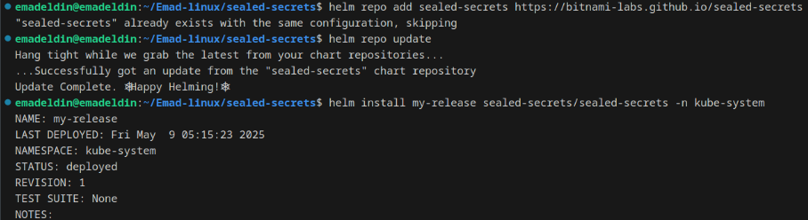

2. **operator will create public Key and private key that we will use In encrypting and decrypting** 

3. **You can deploy manifest by is self or using helm to actually go ahead and deploy the sealed secrets operator for You**
4. **at this point the operator has been deployed and everything is good to go** 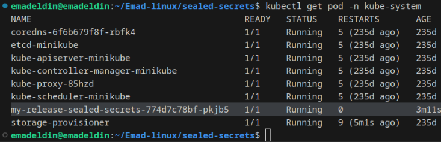

5. **After This Step We Will start To Install KubeSeal Cli With The latest version V0.29.0 From The Official repository** 

   **[Bitnami’s sealed-secrets controller](https://github.com/bitnami-labs/sealed-secrets?tab=readme-ov-file#linux)** 

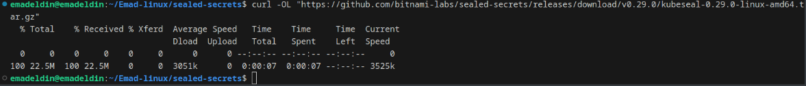
```bash
tar -xvzf kubeseal-v0.29.0-linux-amd64.tar.gz kubeseal
sudo install -m 755 kubeseal /usr/local/bin/kubeseal
```

**to List the name of Service and test the connectivity between Kubeseal and kubernetes cluster**

```bash
kubectl get service -n kube-seystem
kubeseal --fetch-cert --controller-name my-release-sealed-secrets --controller-namespace kube-system
```
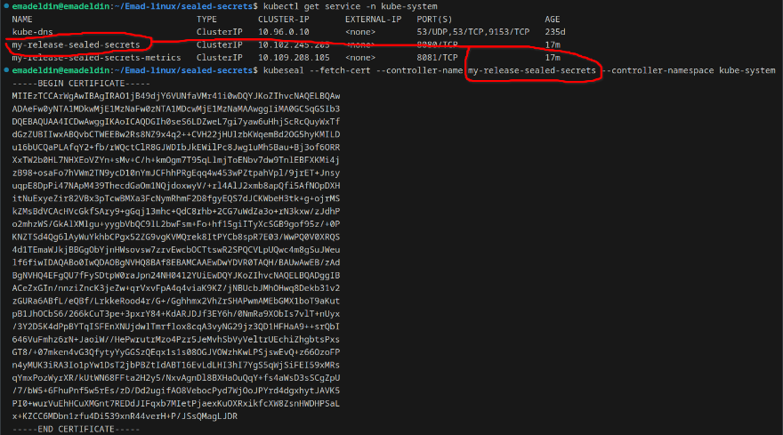

6. **The next step I will Create Regular Kubernetes Secret Which is in base64 Encoding Format** 

   **and i will test Decoding it to see the original Secret**

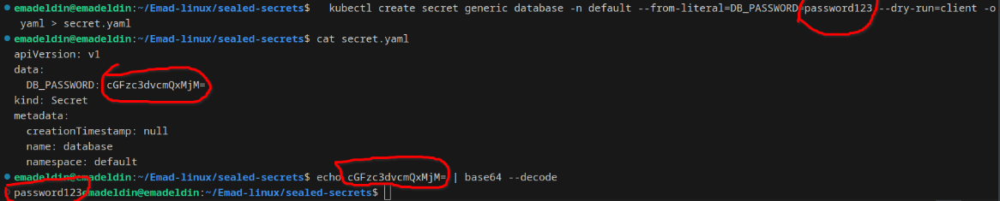

7. **The next step is to take the regular secret (<u>Secret.yaml</u>) as an input and convert it as a sealed secret(<u>Sealed-Secret.yaml</u>) that the password is fully encrypted and now you can push it to github repository** 

   **and don't worry about somebody to get access to this repository because it is encrypted**

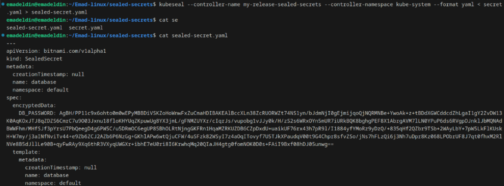

```bash
kubeseal --controller-name my-release-sealed-secrets --controller-namespace kube-system --format yaml < secret.yaml > sealed-secret.yaml
```

8. **The Next step is to apply the kubeseal SealedSecret to our Kubernetes Cluster And After this I Will get The Original Secret After decryption**


 

9. **To Check the Sealed Secret Within Our Cluster and check that encryption successful**

   ```bash
   kubectl get sealedsecret
   kubectl describe sealedsecret
   ```

  
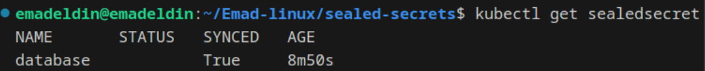


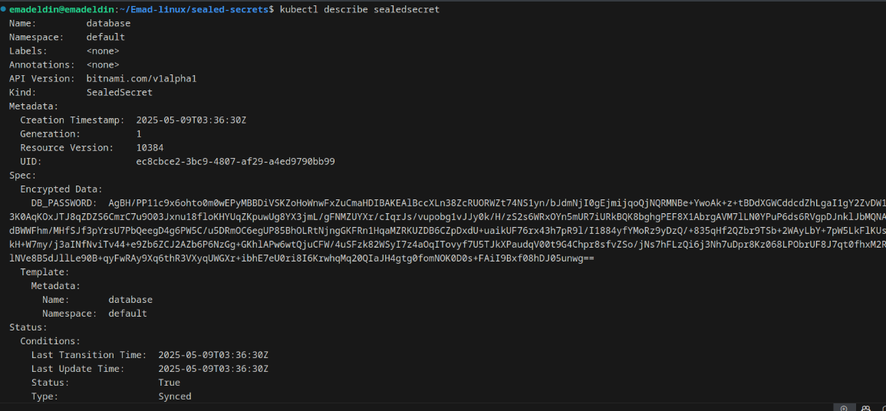

---

## Re-encryption Strategy (Bonus)

To re-encrypt all sealed secrets using the latest public key:

1. Fetch all SealedSecrets in all namespaces:

   ```bash
   kubectl get sealedsecrets --all-namespaces -o json > all-sealed.json
   ```


**Public key is available via and it is help anyone in the team in encrypting Operation:**

```bash
kubeseal --fetch-cert --controller-name my-release-sealed-secrets --controller-namespace kube-system > pub-cert.pem
```

### Extract Controller’s Private Key (on the cluster)

```bash
kubectl get secret -n kube-system -l sealedsecrets.bitnami.com/sealed-secrets-key=active -o yaml
```

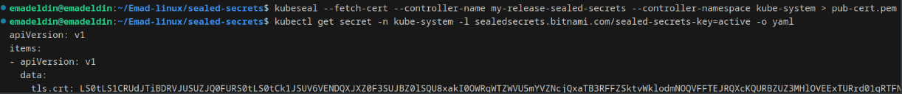

### Re-encrypt Sealed Secrets using Latest Public Key

If you're on a secure admin workstation and already trust the current sealed secret (and don’t need to see the plaintext secret), you can **re-encrypt directly**:

```bash
kubeseal --re-encrypt --controller-name my-release-sealed-secrets --controller-namespace kube-system < sealed-secret.yaml > sealed-secret-rotated.yaml
```

This **does not decrypt**, but updates the encryption to use the latest public key.

###  Replace the Old SealedSecret in the Cluster

```bash
kubectl apply -f sealed-secret-rotated.yaml
```


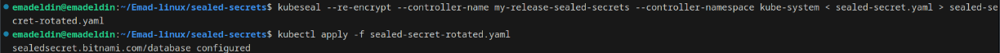

Then verify:

```bash
kubectl get sealedsecret
```

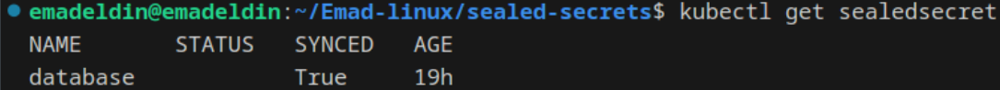


###  Verify Secret Decryption (Check Result)

You can decode the base64 value in the output of:

```bash
kubectl get secret database -o yaml # to see the base64 encoded and ensure 
echo cGFzc3dvcmQxMjM= | base64 --decode 
```


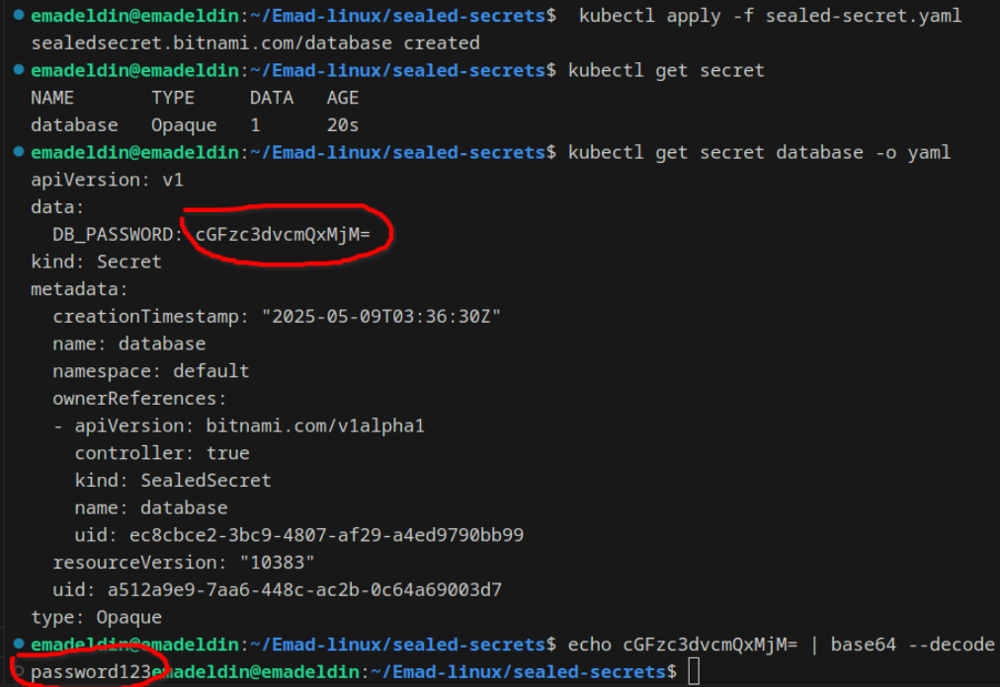

---

### For Logging or reporting mechanism to track the re-encryption process and any errors (bonus) :
- **We can Do This using Two Methods** 

  1. By using bash Script To Simplified The Process using Automation and in this case we may use script like this : 

     ```bash
     touch reencrypt-log.txxt # the file at which the loggs will forward to it
     vim log.txt
     chmod +x log.txt # to make the file executable 
     ./log.txt # for execution 
     ```

     

     ```bash
     #!/bin/bash
     
     {
       echo "[START] Re-encryption started at $(date '+%F %T')"
     
       SECRET_NAME="database"
       NAMESPACE="default"
     
       if kubectl get sealedsecret "$SECRET_NAME" -n "$NAMESPACE" -o yaml > sealed.yaml &&
          kubeseal --recovery-unseal --sealed-secret sealed.yaml --controller-private-key key.pem --format yaml > decrypted.yaml &&
          kubeseal --cert pub-cert.pem --format yaml < decrypted.yaml > resealed.yaml &&
          kubectl apply -f resealed.yaml; then
     
         echo "[✓] $(date '+%F %T') - Successfully re-encrypted '$SECRET_NAME' in '$NAMESPACE'"
       else
         echo "[✗] $(date '+%F %T') - ERROR re-encrypting '$SECRET_NAME' in '$NAMESPACE'"
       fi
     
       echo "[END] Re-encryption finished at $(date '+%F %T')"
     } >> reencrypt-log.txxt 2>&1
     
     
     ```

     
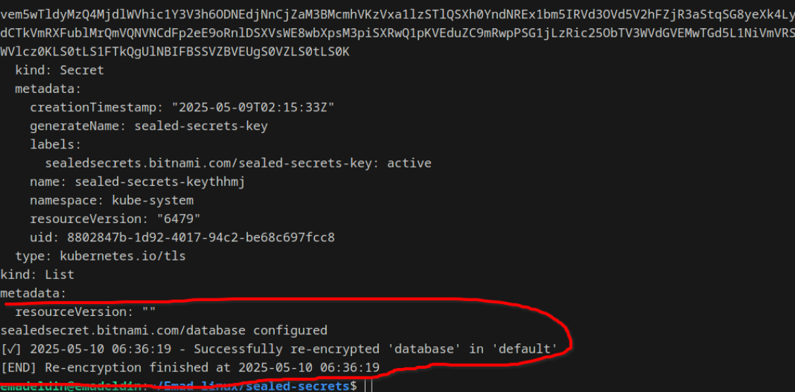


2. The Second Method is manually 

   By Creating File And add the loggs manually on it like this ***but not recommend , the Automation in this case is the best practice for it***  : 

   ```bash
   vim Logs.txt
   ```

```vbscript
[✓] mysecret - default namespace - re-encrypted successfully at 2025-05-08 17:42
[✗] db-password - staging namespace - FAILED to unseal (Error: ...)

Total processed: 5
Successful: 4
Failed: 1

```

----

## **To** **ensure the security of the Sealed Secrets private keys** (Bonus):

1. Do NOT store private keys in Git or any version control

2. Use **role-based access control (RBAC)** to limit who can access the key in your clusters.

   Only **cluster administrators** should have access to get Sealed Secrets :

   ```bash
   kubectl get secret sealed-secrets-key -n kube-system
   ```

3. Rotate Keys Periodically

4. Use Secure Transfer Methods When moving the private key to another cluster:

   - Avoid using plain email or chat platforms.

   - Use **SCP over SSH**, **SFTP**, or a **secure vault** (e.g., HashiCorp Vault, AWS Secrets Manager).

     Example : 

     ```bash
     scp my-private-key.pem user@new-cluster-host:/secure/path/
     ```

5. Delete the Key Once you've transferred  and re-deployed:

   ```bash
   rm -f my-private-key.pem
   ```

   ---

   Thank you for your time and review.

   **Emad Eldin Adel** 
